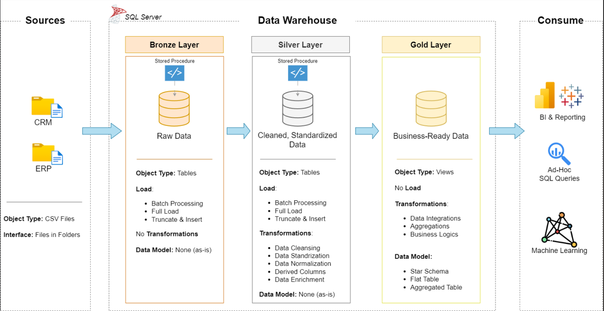

# SQL-Data-Warehouse-Project# 

A complete project demonstrating how to design, build, and analyze a modern **Data Warehouse** using the **Medallion Architecture (Bronze–Silver–Gold layers)**. This project showcases how raw data from multiple sources can be transformed into clean, business-ready datasets for analytics and reporting using **SQL Server**.

---

## Tech Stack

- **Database:** SQL Server  
- **Languages:** T-SQL, SQL  
- **ETL:** Stored Procedures, Bulk Insert  
- **Data Modeling:** Star Schema, Dimension & Fact Tables  
- **Tools:** SSMS, Excel  

---

## Project Overview

This project simulates a modern **data warehousing pipeline** that integrates data from two systems, **CRM** and **ERP**, to deliver unified business insights.  

1. **Requirement Analysis** – Understanding data sources, use cases, and KPIs.  
2. **Architecture Design** – Building a layered architecture (Bronze, Silver, Gold).  
3. **Data Ingestion (Bronze Layer)**  
   - Load raw data from CSV files into SQL Server.  
   - Maintain traceability and auditability (no transformations).  
4. **Data Cleaning & Standardization (Silver Layer)**  
   - Handle duplicates, nulls, abbreviations, datatype mismatches.  
   - Apply business rules and derive new columns.  
5. **Data Modeling & Business Layer (Gold Layer)**  
   - Design **Star Schema** with Fact and Dimension tables.  
   - Create **Views** for reporting and dashboards.  

---

## Key Learnings

- Hands-on experience in **Data Warehouse design** using the **Medallion Architecture**.  
- Best practices in **data ingestion, validation, and ETL scripting** with error handling.  
- Implemented **data standardization and enrichment** to ensure consistency across systems.  
- Learned to **model data for analytics** using **Fact and Dimension tables**.  
- Gained experience designing **stored procedures** for modular and reusable ETL operations.  

---

## Translating to a Production Environment

In a production setup, this architecture can be enhanced using:  
- **Azure Data Factory** or **Databricks** for scalable ETL orchestration.  
- **Data Lakehouse (Delta Lake)** for handling semi-structured/unstructured data.  
- **CI/CD pipelines** for automated testing and deployment.  

This architecture easily scales to a **modern cloud ecosystem**, supporting streaming data, ML integration, and real-time analytics.

---

## Conclusion

This project bridges the gap between **data engineering and analytics**, demonstrating how structured data pipelines can drive meaningful business insights.  
By applying clean architectural principles, consistent naming conventions, and robust data validation, this project builds a strong foundation for enterprise-grade data solutions.

